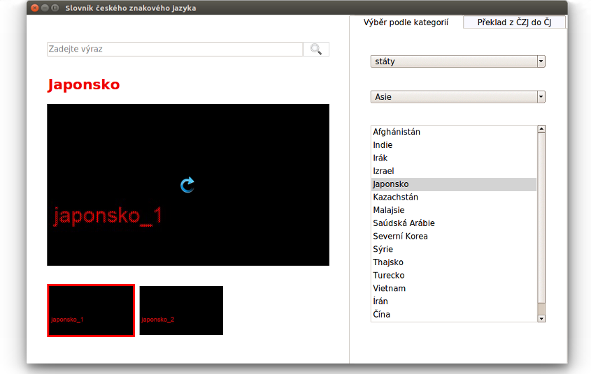

# Czech Sign Language Dictionary

> A bilingual dictionary for translating expressions to and from Czech and Czech Sign Language.

The Dictionary is built in Python 3 using the tkinter library and SQLite database.




**Note:** As I don't have permission to share publically the videos with sign language translations, the videos in the application don't capture actual signing persons – there are demo animations (with a piece of text running across the screen) instead.

## Requirements

* Linux
* Python 3.5+
* Pillow - the PIL fork: https://python-pillow.org/
* OpenCV: https://opencv.org/
* NumPy: http://www.numpy.org/
* (Optional) [Clearlooks ttk theme](https://github.com/RedFantom/ttkthemes/tree/master/ttkthemes/themes/clearlooks)

## Installation

Linux:

The application can be run from `dictionary` directory by:
```
python main.py
```
after installing the dependencies:

**Pillow and NumPy**

```
$ pip3 install Pillow numpy
```
**OpenCV**

To install OpenCV, see for example Adrian Rosebrock's [tutorial](https://www.pyimagesearch.com/2016/10/24/ubuntu-16-04-how-to-install-opencv/) (for Ubuntu)

**Clearlooks theme** (Optional)

Download the Clearlooks theme from [RedFantom's repo](https://github.com/RedFantom/ttkthemes/tree/master/ttkthemes/themes/clearlooks) using Git sparse checkout
```
mkdir newtheme
cd newtheme
git init
git config core.sparsecheckout true
echo "ttkthemes/themes/clearlooks" > .git/info/sparse-checkout
git remote add -f origin https://github.com/RedFantom/ttkthemes.git
git pull origin master
```
Rename `clearlooks.tcl`
```
mv ttkthemes/themes/clearlooks/clearlooks.tcl ttkthemes/themes/clearlooks/clearlooks8.5.tcl
```
Set the `TCLLIBPATH` variable
```
sudo mkdir /usr/share/ttkthemes
sudo cp -r ttkthemes/themes/clearlooks /usr/share/ttkthemes
echo "export TCLLIBPATH=/usr/share/ttkthemes" >> ~/.bashrc
```
Clean after yourself
```
cd ..
rm -rf newtheme
```

### Running from a docker container

Another way of running the application is from a docker container:
```
docker build -t dictionary .
docker run -v /tmp/.X11-unix:/tmp/.X11-unix -e DISPLAY=$DISPLAY dictionary
```
Might require additional settings in order to enable the container to connect to a host's X server. The easiest (but not the most secure) way to do that is by setting:
```
xhost +local:root
```
and resetting after we are finished using the container:
```
xhost -local:root
```

## Attribution

In the Czech Sign Language Dictionary application the following icons 
(located at ./dictionary/images directory) are used:

* hint\_icon.png is an [icon](findicons.com/icon/455110/light_bulb_on) by [Janik Baumgartner](kinaj.com) licensed under [CC BY](creativecommons.org/licenses/by/4.0/)

* replay\_arrow.png is an [icon](https://findicons.com/icon/261425/arrow_clockwise) by [Momenticons](https://momentumdesignlab.com/) licensed under [CC BY](creativecommons.org/licenses/by/4.0/)

* add\_icon.png, close\_icon.png, del\_draw.png, del\_icon.png, search\_icon.png, 
submit\_icon.png are icons from the [Koloria icons set](www.graphicrating.com/2012/06/14/koloria-free-icons-set/)

## Meta

Katerina Zuzanakova - katerina.zuzanakova@gmail.com

Distributed under the MIT license. See ``LICENSE.md`` for more information.

https://github.com/katerinazuzana/sign-language-dictionary
